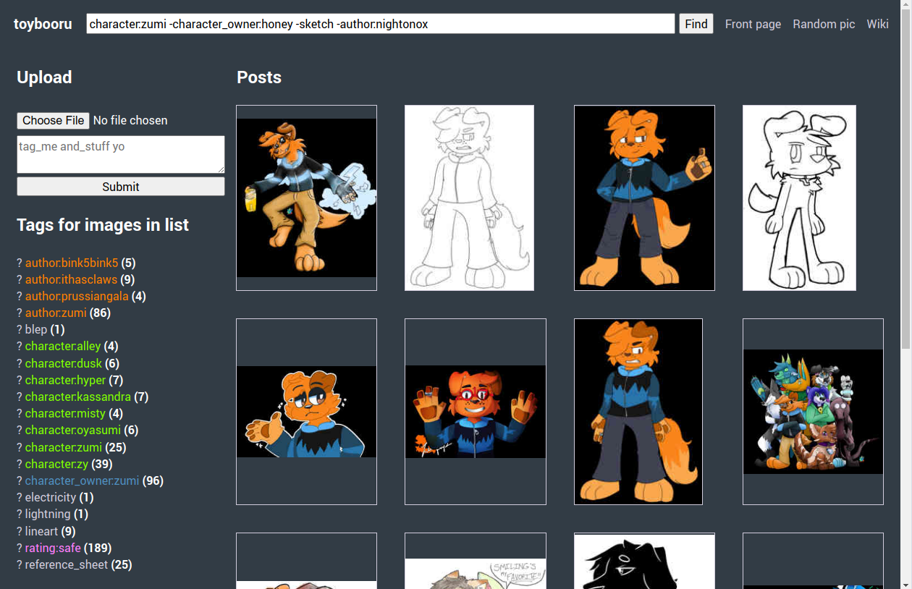

# Toybooru



Exactly what it says on the tin: a toy booru-like web app.

Has not been fuzzed yet and I'm not even sure the queries are secure yet—**do not use in production!**

You should put it behind something like Nginx, maybe to enforce file size limits?

```
nimble start
```

Clean the database by
```
nimble cleanDb
```

**Requires devel packages for: libsodium**

Database support:

* SQLite ≥ 3.39.0 (default)
* PostgreSQL (use `nimble -d:usePostgres start`)

Configuration is hard-coded for now, look at `src/settings.nim`.

## What's here?

- Basic [CRUD](https://en.wikipedia.org/wiki/Create,_read,_update_and_delete)
- Tag searching: unprefixed keywords signify an AND relation, keywords prefixed with `-` signify a NOT relation to be applied on top.
- Pagination
- (JS-only) Tag autocomplete, available on the following forms: Search, upload, edit.
- "Namespaced" tags—really just decorated tags if there's a : separating the two parts. Decorations are applied with CSS. Predefined in `screen.css`: `author`, `character_owner`, `character`, `rating`.
- Responsive layout
- Rolling a random picture. Will also be limited to a subset of pictures provided you have an existing tag search query (GET parameter: `q`)
- Utility for importing from [Hydrus Network](https://hydrusnetwork.github.io/hydrus/)… provided you've exported with tags to a corresponding text file.
- Find similar images

## Todo

- User accounts (getting there)
- Wiki
- Adding source to images
- Comments, maybe?
- …
